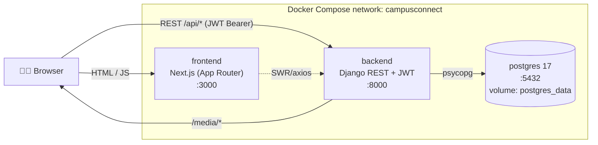
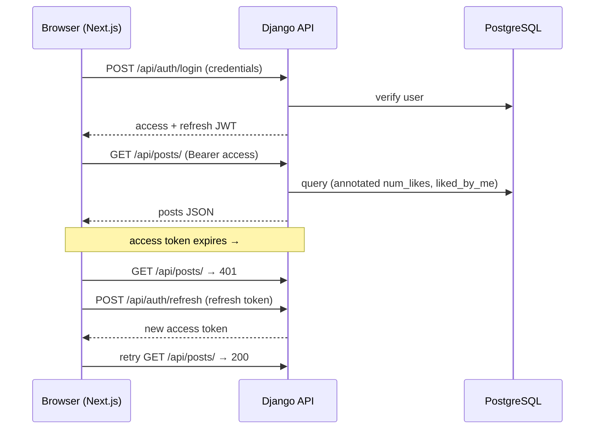

# 🎓 Campus Connect

A social network built **for students, by students** — share posts, like and comment,
join your campus (IITs, NITs, IIITs), customise your profile with cute avatars and
themes, and recolour the whole app to any accent you like.

> **Monorepo:** a **Django REST** backend (`backend/`) + a **Next.js** frontend (`frontend/`),
> with **PostgreSQL** as the database. The whole stack runs with a single `docker compose up`.

---

## 📑 Table of contents

- [Features](#-features)
- [Tech stack](#-tech-stack)
- [Architecture](#-architecture)
  - [High-level picture](#high-level-picture)
  - [Backend (Django REST)](#backend-django-rest)
  - [Data model](#data-model)
  - [Frontend (Next.js)](#frontend-nextjs)
  - [Request & auth flow](#request--auth-flow)
  - [Containerization](#containerization)
- [Run with Docker (recommended)](#-run-with-docker-recommended)
- [Run manually (without Docker)](#-run-manually-without-docker)
- [Environment variables](#-environment-variables)
- [API reference](#-api-reference)
- [Project structure](#-project-structure)
- [Institute logos & photos](#-institute-logos--photos)
- [Troubleshooting](#-troubleshooting)
- [Status & roadmap](#-status--roadmap)

---

## ✨ Features

- **Feed** — create, edit, like, comment on, and delete posts; text posts and image posts, with an optional title and "feeling".
- **Campuses** — 79 seeded institutes (IITs / NITs / IIITs); join one, leave, and browse. Each campus has a generated emblem (or a real logo/banner if provided).
- **Profiles** — editable name / bio / tagline, **DiceBear cute avatars**, and selectable **profile templates**.
- **Theming** — light/dark mode **and** a full accent-colour picker (any hue on the wheel), applied app-wide and persisted.
- **Auth** — JWT login/register with silent access-token refresh, plus optional **Google sign-in**.
- **Help & contact** — in-app help with a contact form that emails the maintainer (the destination address is never exposed to the browser).
- **Fast uploads** — images are downscaled/compressed in the browser before upload, so posting is quick and images load fast for everyone.
- **Legal pages** — privacy, terms, and accessibility routes built in.

---

## 🧰 Tech stack

| Layer     | Stack |
|-----------|-------|
| Backend   | Python 3.11, Django 5.2, Django REST Framework, SimpleJWT, PostgreSQL 17, **`uv`** |
| Frontend  | Next.js 16 (App Router, Turbopack), React 19, TypeScript, Tailwind CSS v4, HeroUI v3, SWR, axios, **`pnpm`** |
| Infra     | Docker + Docker Compose (postgres + backend + frontend) |

---

## 🏗️ Architecture

### High-level picture



- The **frontend** is a Next.js App-Router app. The browser loads it from `:3000`, then talks **directly** to the Django API at `:8000/api/*` (via axios + SWR). CORS allows the frontend origin.
- The **backend** is a Django REST API. It owns auth, posts, campuses, comments, and contact; it persists everything to **PostgreSQL** and serves user-uploaded images under `/media/*`.
- In Docker, all three run on a private Compose network; the frontend and backend ports are published to your host, and the DB lives in a persistent named volume.

### Backend (Django REST)

The project (`backend/backend/`) wires together **four Django apps**, each owning one slice of the domain:

| App | Responsibility | Routes (`include`d in `backend/urls.py`) |
|---|---|---|
| `users` | Custom user model, auth (register/login/refresh/me), Google sign-in, profile | `/api/auth/*` |
| `posts` | Posts + likes, feed, per-user posts, CRUD, like/unlike | `/api/posts/*` |
| `campuses` | Institute directory, join/leave membership | `/api/campuses/*` |
| `comments` | Comments on posts | `/api/comments/*` |
| *(project)* | Contact/help form → email | `/api/contact/` |

Key cross-cutting choices (in `backend/backend/settings.py`):

- **Auth** — `rest_framework_simplejwt` is the default auth class; the custom `AUTH_USER_MODEL = users.User` uses a **UUID** primary key. Clients send `Authorization: Bearer <access>` and silently refresh via `/api/auth/refresh/`.
- **Throttling** — DRF rate limits: anon **40/min**, authenticated user **400/min**, contact form **5/min**.
- **Caching** — the campus list is cached (LocMemCache) and invalidated on join/leave/CRUD.
- **Query optimization** — feed & profile annotate `num_likes` + `liked_by_me`; the campus list annotates `num_students` — no N+1. Indexes on `Post(-created_at)`, `(author, -created_at)`, `(campus, -created_at)`.
- **CORS** — `corsheaders` allows the configured frontend origins.
- **Media** — uploaded images go to `MEDIA_ROOT` (`backend/media/`, gitignored) under `posts/%Y/%m/`; served at `/media/*` in dev.
- **Email** — console backend in dev (prints to the terminal); set the SMTP `EMAIL_*` vars for real delivery.

### Data model

```mermaid
erDiagram
    USER ||--o{ POST : "authors"
    USER ||--o{ COMMENT : "writes"
    USER ||--o{ LIKE : "gives"
    USER }o--|| CAMPUS : "joins (SET_NULL)"
    CAMPUS ||--o{ POST : "scopes"
    POST ||--o{ COMMENT : "has"
    POST ||--o{ LIKE : "has"

    USER {
        uuid id PK
        string username
        string bio
        string avatar_url
        string profile_template
        string tagline
        fk campus "students"
    }
    CAMPUS {
        uuid id PK
        string name
        slug slug UK
        string city
        string state
        string logo_url
        string banner_url
    }
    POST {
        uuid id PK
        fk author
        fk campus
        string post_type "text|image"
        string title
        text content
        string feeling
        file image "posts/%Y/%m/"
        datetime created_at
    }
    COMMENT {
        uuid id PK
        fk post
        fk author
        text content
    }
    LIKE {
        uuid id PK
        fk user
        fk post
    }
```

- All primary keys are **UUIDs**.
- A user belongs to at most one `Campus` (`on_delete=SET_NULL`, reverse name `students`).
- A `Post` is authored by a user and scoped to a campus; it carries a `post_type` (`text`/`image`), optional `title`, `content`, `feeling`, and an optional uploaded `image`.
- `Like` is a join row between a user and a post (one per pair); `Comment` belongs to a post + author.

### Frontend (Next.js)

App Router with **route groups** that separate the public/auth area from the authenticated app:

```
src/app/
├── layout.tsx                root layout — fonts, providers, no-flash theme script
├── icon.svg                  favicon (brand mark)
├── (auth)/
│   ├── login/                login
│   └── register/             register
└── (main)/                   authenticated shell (sidebar + dialogs)
    ├── layout.tsx            app chrome (AppSidebar / rails / docks)
    ├── feed/                 the main feed
    ├── campus/               campus directory + your campus
    ├── profile/              your profile
    ├── posts/[id]/           single-post view
    └── privacy/ terms/ accessibility/   legal pages
```

Supporting layers:

- **`contexts/`** — React context providers: `AuthContext` (session + tokens), `ThemeAccentContext` (accent hue), `DialogsContext` (global modals).
- **`hooks/`** — SWR data hooks: `usePosts`, `useCampuses`, `useComments` (caching, revalidation, optimistic updates).
- **`lib/`** — `api.ts` (axios instance + JWT refresh interceptor), `avatars.ts` (DiceBear), `banners.ts`, `templates.ts`, `themes.ts`, `image.ts` (client-side image compression), `legal.ts`.
- **`components/`** — `layout/` (AppSidebar, ThemePicker, NotificationsBell, search/docks), `posts/` (PostCard, CreatePostModal), `profile/` (EditProfileModal), `campus/`, `comments/`, plus `Logo`, `Markdown`, About/Help modals.
- **`types/`** — shared TypeScript interfaces for the API payloads.

How a few things work:

- **Theming** — the whole app's accent is one CSS variable (`--app-hue`) on `<html>`, set by the 🎨 picker, persisted in `localStorage`, and applied pre-paint by an inline script in `layout.tsx`. Light/dark via `next-themes`.
- **Avatars / emblems** — generated on the fly via the free DiceBear API; a user's chosen avatar is saved as `avatar_url`. Campuses without a real logo render a generated `CampusEmblem`.
- **Uploads** — `lib/image.ts` downscales large images (canvas → JPEG) in the browser before they're sent to the API.

### Request & auth flow



This silent-refresh cycle (the `401 → refresh → retry` you see in the server logs) is handled by the axios interceptor in `lib/api.ts`.

### Containerization

`docker-compose.yml` defines three services on a private `campusconnect` network:

| Service | Image / build | Port | Notes |
|---|---|---|---|
| `postgres` | `postgres:17-alpine` | 5432 (internal) | data in the **`postgres_data`** named volume; healthcheck-gated |
| `backend` | built from `backend/Dockerfile` (python 3.11 + `uv`) | `8000:8000` | waits for postgres to be healthy; source mounted for live reload |
| `frontend` | built from `frontend/Dockerfile` (node 22 + `pnpm`) | `3000:3000` | depends on backend; `node_modules` / `.next` in named volumes |

State lives in **volumes**, not images — so images are portable but your data stays on the host (see [Status & roadmap](#-status--roadmap)).

---

## 🐳 Run with Docker (recommended)

The entire stack — PostgreSQL, backend, and frontend — comes up with one command.

**Prerequisites:** Docker + Docker Compose.

```bash
# 1. Backend environment — values must match docker-compose.yml
cp backend/.env.example backend/.env
#   Set these for the Docker network:
#     POSTGRES_DB=campusconnect
#     POSTGRES_USER=campusconnect
#     POSTGRES_PASSWORD=campusconnect
#     POSTGRES_HOST=postgres        # the compose service name, NOT localhost
#     POSTGRES_PORT=5432
#   …and a real SECRET_KEY.

# 2. Build & start everything (detached)
docker compose up -d --build

# 3. First-time database setup — run INSIDE the backend container
docker compose exec backend uv run python manage.py migrate
docker compose exec backend uv run python manage.py seed_campuses     # 79 campuses
docker compose exec backend uv run python manage.py createsuperuser   # for /admin
```

Open **http://localhost:3000**, register, and you're in. 🎉

**Everyday commands**

```bash
docker compose up -d                 # start
docker compose down                  # stop (add -v to ALSO wipe the DB volume)
docker compose ps                    # status
docker compose logs -f frontend      # follow logs (or: backend / postgres)
docker compose exec backend uv run python manage.py <command>
```

> ⚠️ **Don't also run `uv run runserver` / `pnpm dev` on your host while the containers are up** — they'd collide on ports 8000/3000.

---

## 💻 Run manually (without Docker)

You need **two terminals** and a local PostgreSQL. Full details live in the sub-READMEs:
[backend/README.md](backend/README.md) · [frontend/README.md](frontend/README.md).

**Backend**
```bash
cd backend
cp .env.example .env          # set POSTGRES_* to your local DB + a SECRET_KEY
uv sync
uv run python manage.py migrate
uv run python manage.py seed_campuses
uv run python manage.py createsuperuser
uv run python manage.py runserver         # → http://localhost:8000
```

**Frontend**
```bash
cd frontend
cp .env.local.example .env.local           # set NEXT_PUBLIC_API_URL=http://localhost:8000/api
pnpm install
pnpm dev                                    # → http://localhost:3000
```

---

## 🔑 Environment variables

**Backend** (`backend/.env` — gitignored). Full table in [backend/README.md](backend/README.md#environment-variables-env).

| Variable | Required | Notes |
|---|---|---|
| `SECRET_KEY` | yes | Django secret key. |
| `DEBUG` | no | `True` in dev. |
| `POSTGRES_DB` / `POSTGRES_USER` / `POSTGRES_PASSWORD` / `POSTGRES_HOST` / `POSTGRES_PORT` | yes | DB connection. For Docker, `POSTGRES_HOST=postgres`. |
| `GOOGLE_CLIENT_ID` | no | Enables Google sign-in verification. |
| `CONTACT_EMAIL` | no | Destination for Help-form messages (server-side only). |
| `EMAIL_BACKEND` + `EMAIL_*` / `DEFAULT_FROM_EMAIL` | no | Unset → console backend; set SMTP vars for real delivery. |

**Frontend** (`frontend/.env.local`). Full table in [frontend/README.md](frontend/README.md#environment-variables).

| Variable | Required | Purpose |
|---|---|---|
| `NEXT_PUBLIC_API_URL` | yes | Backend API base **including `/api`**. Defaults to `http://localhost:8000/api`. |
| `NEXT_PUBLIC_GOOGLE_CLIENT_ID` | no | Google OAuth client ID; blank hides the Google button. |

---

## 🔌 API reference

Base path `/api`. All routes require a JWT `Authorization: Bearer <token>` **except** register, login, and contact. Full table in [backend/README.md](backend/README.md#api-overview).

| Method | Path | Purpose |
|---|---|---|
| POST | `/api/auth/register/` · `/login/` · `/refresh/` | Account + JWT lifecycle |
| GET / PATCH | `/api/auth/me/` | Current user; PATCH to edit profile |
| POST | `/api/auth/google/` | Google sign-in |
| GET / POST | `/api/posts/` · `/api/posts/create/` | Feed (`?limit=`, max 100) / create |
| GET | `/api/posts/me/` | Current user's posts |
| PATCH/PUT · DELETE | `/api/posts/<id>/update/` · `/delete/` | Edit / delete own post |
| POST / DELETE | `/api/posts/<id>/like/` · `/unlike/` | Like / unlike |
| GET | `/api/comments/post/<id>/` | Comments for a post |
| GET | `/api/campuses/` | List campuses (cached 5 min) |
| POST | `/api/campuses/<id>/join/` · `/api/campuses/leave/` | Membership |
| POST | `/api/contact/` | Help form → emails `CONTACT_EMAIL` (rate-limited) |

---

## 📁 Project structure

```
campus-connect/
├── docker-compose.yml        postgres + backend + frontend
├── backend/                  Django 5.2 + DRF + JWT + PostgreSQL  → :8000
│   ├── backend/              settings, urls, asgi/wsgi
│   ├── users/                custom User, auth, profile  (/api/auth)
│   ├── posts/                Post + Like, feed, CRUD      (/api/posts)
│   ├── campuses/             Campus + membership          (/api/campuses)
│   ├── comments/             Comment                      (/api/comments)
│   ├── media/                user uploads (gitignored)
│   ├── Dockerfile
│   └── README.md
└── frontend/                 Next.js + React + Tailwind + HeroUI  → :3000
    ├── src/app/              App Router: (auth) + (main) route groups
    ├── src/components/       UI (layout, posts, profile, campus, comments)
    ├── src/contexts/         Auth, ThemeAccent, Dialogs
    ├── src/hooks/            SWR data hooks
    ├── src/lib/              api (axios), avatars, themes, image compression
    ├── src/types/            shared TS interfaces
    ├── Dockerfile
    └── README.md
```

---

## 🖼️ Institute logos & photos

To respect trademark/copyright, the repo ships **generated emblems** and **themed
stock photos** as fallbacks — it does **not** bundle official institute logos.

To use real assets: open **http://localhost:8000/admin/ → Campuses**, edit a campus,
and paste a **Logo URL** and/or **Banner URL** (an official media-kit asset, or a freely-licensed
image from [Wikimedia Commons](https://commons.wikimedia.org) with attribution). Leave them blank
to keep the generated emblem/photo.

---

## 🛟 Troubleshooting

| Symptom | Fix |
|---|---|
| Frontend loads but every request 401 / network error | Backend not running, or `NEXT_PUBLIC_API_URL` wrong — it must point at `http://localhost:8000/api`. |
| `CORS` error in the browser console | Add your frontend origin to `CORS_ALLOWED_ORIGINS` in `backend/backend/settings.py`. |
| `OperationalError` / can't connect to DB | Postgres not running, or `.env` DB creds don't match. In Docker, `POSTGRES_HOST` must be `postgres`. |
| Campus list is empty | Run `seed_campuses` (inside the backend container for Docker). |
| Docker: "port already allocated" on 8000/3000 | A host `runserver`/`pnpm dev` is still running — stop it; don't run both. |
| Docker: build fails with "no space left" | Free disk; the frontend image needs a few GB to build. |
| Avatars / campus images don't load | They're external (DiceBear / stock) — check connectivity. |
| Help form says "not configured" | Set `CONTACT_EMAIL` in `backend/.env`. |

More detail lives in each sub-README.

---

## 🚦 Status & roadmap

This is an **early alpha**, configured for **local development**:

- Backend runs Django's `runserver`; frontend runs `pnpm dev` (Turbopack) — neither is a production server.
- `DEBUG=True`, in-memory cache, console email backend.
- The Docker setup is great for "clone → `docker compose up` → it works on any machine," **but it is not yet a public-hosting deployment.**

**Before hosting publicly**, plan for: `DEBUG=False` + `ALLOWED_HOSTS`, a real WSGI/ASGI server (gunicorn/uvicorn) and `next build && next start`, secrets from the host environment (not committed), a managed/persistent PostgreSQL with backups, Redis/Memcached cache + SMTP email, and a reverse proxy with HTTPS.

> 💾 **Data note:** Docker **images** are portable, but your **data** lives in the `postgres_data` volume and uploaded files in `backend/media/` — those stay on the host and must be migrated/backed up separately; they don't travel with the image.
